# INC-002: Mermaid Syntax Error - Emojis in Node Labels

**Date:** 2026-01-30
**Severity:** High (Diagram fails to render)
**Status:** Resolved
**Tags:** #mermaid #emoji #unicode #parsing

---

## Symptom

The Flow Diagram containing emojis in node labels failed to render, showing "Syntax error in text" even after fixing the HTML entity encoding issue (INC-001).

### Original Mermaid Code

```mermaid
flowchart TD
    A[😫 Too many tabs open] --> B[Click Snooze Tabs icon]
    ...
    M -->|No| N[😌 Focus restored]
```



---

## Investigation

### Hypothesis 1: Emoji Unicode Issues
Emojis are multi-byte Unicode characters that can cause parsing issues in text-based DSLs.

### Test Performed

Rendered the same diagram with and without emojis:

```javascript
// With emojis - FAILS
testDiv.textContent = 'flowchart TD\n    A[😫 Test] --> B[Result]';
await mermaid.run({ querySelector: '.test' });
// Result: Syntax error

// Without emojis - WORKS
testDiv.textContent = 'flowchart TD\n    A[Test!] --> B[Result]';
await mermaid.run({ querySelector: '.test' });
// Result: Renders correctly
```

### Root Cause

**Mermaid v10's parser has inconsistent emoji support in node labels.**

While Mermaid documentation suggests emojis work in some contexts, the combination of:
- HTML entity decoding
- Docsify's text processing
- Emoji characters in square bracket notation `[😫 text]`

Creates an edge case where parsing fails.

---

## Resolution

### Fix Applied

Removed emojis from all node labels in the Flow Diagram:

**Before:**
```mermaid
A[😫 Too many tabs open] --> B[Click Snooze Tabs icon]
M -->|No| N[😌 Focus restored]
```

**After:**
```mermaid
A[Too many tabs open!] --> B[Click Snooze Tabs icon]
M -->|No| N[Focus restored!]
```

### Trade-off Analysis

| Aspect | With Emojis | Without Emojis |
|--------|-------------|----------------|
| Visual appeal | More playful | More professional |
| Reliability | Inconsistent | Always works |
| Accessibility | Screen readers may struggle | Better for assistive tech |
| Cross-platform | Varies by OS/browser | Consistent |

**Decision:** Reliability and accessibility outweigh visual flair for documentation.

---

## Verification

After removing emojis, the diagram rendered correctly when fresh content was loaded:

```javascript
// Fetch fresh markdown and render
const response = await fetch('https://snoozetabs.com/user-guide/use-cases/tab-overwhelm.md?_t=' + Date.now());
const text = await response.text();
const match = text.match(/```mermaid\n([\s\S]*?)```/);

testDiv.textContent = match[1];
await mermaid.run({ querySelector: '.test' });
// Result: Renders correctly - shows "Too many tabs open!" etc.
```

---

## Key Learnings

1. **Emojis in DSLs are risky** - Even if they "work" in simple tests, complex processing pipelines can break them.

2. **Simplify for reliability** - Documentation diagrams should prioritize clarity over decoration.

3. **Test with the full pipeline** - Testing Mermaid directly isn't enough; test through Docsify's processing.

4. **Exclamation points work as emphasis** - "Focus restored!" conveys similar energy to "😌 Focus restored" without the parsing risk.

---

## Prevention

For future Mermaid diagrams in Docsify:

```markdown
# DO - Plain text with punctuation for emphasis
A[Too many tabs open!] --> B[Click here]

# DON'T - Emojis in node labels
A[😫 Too many tabs open] --> B[Click here]

# OK - Emojis in edge labels (more reliable)
A --> |🎉 Success!| B
```

---

## Related

- [ADR-001: Mermaid Diagram Rendering and Zoom Controls](../decisions/001-mermaid-rendering-and-zoom.md)
- [INC-001: Mermaid HTML Entity Encoding](001-mermaid-html-entity-encoding.md)
- [INC-003: Decision Tree br Tags](003-mermaid-br-tag-escaping.md)
