# INC-003: Decision Tree `<br/>` Tags Displayed Literally

**Date:** 2026-01-30
**Severity:** Medium (Diagram renders but with visual artifacts)
**Status:** Resolved
**Tags:** #mermaid #html #escaping #docsify

---

## Symptom

The Decision Tree diagram rendered, but `<br/>` tags intended for line breaks were displayed literally as text in the node labels:

**Expected:**
```
┌─────────────────────┐
│ ⏰ Tomorrow         │
│ e.g., Hacker News   │
└─────────────────────┘
```

**Actual:**
```
┌──────────────────────────────┐
│ ⏰ Tomorrow<br />e.g., Hacker│
│ News                         │
└──────────────────────────────┘
```

The `<br/>` was literally visible in the rendered SVG.

---

## Investigation

### Original Mermaid Code

```mermaid
flowchart TD
    B -->|Yes| C[⏰ Tomorrow<br/>e.g., Hacker News]
    B -->|Occasionally| D[📅 This Weekend<br/>e.g., DEV Community]
```



### Analysis

The issue is related to INC-001 (HTML entity encoding). The processing flow:

```
Markdown:     <br/>
     ↓
Docsify:      &lt;br/&gt;
     ↓
decodeHtmlEntities():  <br/>  (decoded correctly)
     ↓
Mermaid parser: Treats <br/> as literal text in this context
```

While Mermaid documentation shows `<br>` support in some diagram types, the combination of:
- Entity encoding/decoding
- Self-closing tag syntax `<br/>`
- Node label context `[text<br/>more text]`

Results in Mermaid treating it as literal text rather than a line break.

### Root Cause

**Mermaid's `<br>` support is inconsistent across contexts and encoding scenarios.**

The documented way to create multi-line labels often doesn't work when content passes through HTML encoding layers.

---

## Resolution

### Fix Applied

Replaced multi-line labels with simplified single-line labels:

**Before:**
```mermaid
B -->|Yes| C[⏰ Tomorrow<br/>e.g., Hacker News]
B -->|Occasionally| D[📅 This Weekend<br/>e.g., DEV Community]
E -->|Yes| F[📅 Tomorrow or Weekend<br/>e.g., MDN Guide]
E -->|Reference material| G[🔖 Save for Later<br/>e.g., TypeScript Handbook]
```

**After:**
```mermaid
B -->|Yes| C["TOMORROW preset"]
B -->|Occasionally| D["THIS WEEKEND preset"]
E -->|Yes| F["TOMORROW or WEEKEND"]
E -->|Reference material| G["SAVE FOR LATER"]
```

### Design Decision

Rather than trying to make multi-line labels work, we simplified the labels:

| Original | Simplified |
|----------|------------|
| `⏰ Tomorrow`<br/>`e.g., Hacker News` | `TOMORROW preset` |
| `📅 This Weekend`<br/>`e.g., DEV Community` | `THIS WEEKEND preset` |

Benefits:
- More readable at small sizes
- Works reliably across all contexts
- Examples moved to surrounding documentation text

---

## Verification

Fresh content fetch showed correct rendering:

```javascript
// Check second mermaid block
const response = await fetch('https://snoozetabs.com/user-guide/use-cases/tab-overwhelm.md?_t=' + Date.now());
const text = await response.text();

// Confirm no <br/> in Decision Tree
const decisionTree = text.match(/## Decision Tree[\s\S]*?```mermaid([\s\S]*?)```/);
console.log(decisionTree[1].includes('<br')); // false
console.log(decisionTree[1].includes('TOMORROW preset')); // true
```

---

## Key Learnings

1. **Mermaid + HTML encoding = trouble** - Features that work in plain Mermaid may fail when content is HTML-encoded/decoded.

2. **Self-closing tags are fragile** - `<br/>` is more likely to fail than `<br>`, but both are unreliable in encoded contexts.

3. **Simplification is often better** - Instead of fighting the tooling, simplify the content. "TOMORROW preset" is clearer than "⏰ Tomorrow / e.g., Hacker News" anyway.

4. **Move examples to prose** - If you need to give examples, put them in the markdown text around the diagram, not inside it.

---

## Prevention

For future Mermaid diagrams:

```markdown
# DON'T - Multi-line labels with HTML
C[Line 1<br/>Line 2]

# DON'T - Multi-line with emojis
C[⏰ Tomorrow<br/>e.g., Example]

# DO - Simple, single-line labels
C["TOMORROW preset"]

# DO - If you need examples, add them as a note
C["TOMORROW preset"]
Note: Examples include Hacker News, newsletters
```

---

## Related

- [ADR-001: Mermaid Diagram Rendering and Zoom Controls](../decisions/001-mermaid-rendering-and-zoom.md)
- [INC-001: Mermaid HTML Entity Encoding](001-mermaid-html-entity-encoding.md)
- [INC-002: Mermaid Emoji Parsing](002-mermaid-emoji-parsing.md)
