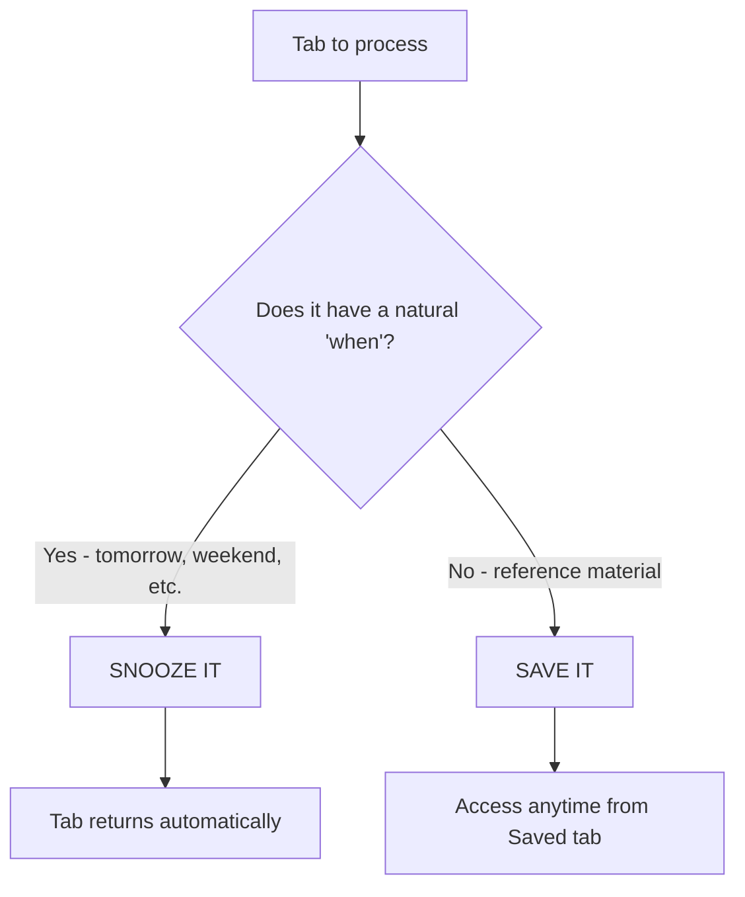

# Snooze Tabs User Guide

> Master tab management: snooze tabs for later, save articles to read, build daily routines.

## Quick Start

1. **Click the Snooze Tabs icon** in your browser toolbar
2. **Pick when you want the tab back**:
  - Click a preset button (Tomorrow, This Evening, etc.)
  - Or click "Pick a date & time" for custom scheduling
3. **Your tab closes** and reappears when the time comes

That's it! Your tab will automatically open when scheduled.

---

## What Can You Do?

| I want to... | Use this feature | Time to learn |
| --- | --- | --- |
| Close a tab and get it back tomorrow | [presets.md](./features/presets.md) | 30 seconds |
| Save an article to read "someday" | [save-for-later.md](./features/save-for-later.md) | 1 minute |
| Open my standup page every morning | [recurring.md](./features/recurring.md) | 2 minutes |
| Separate work tabs from personal | [workspaces.md](./features/workspaces.md) | 2 minutes |
| Access snoozes on another computer | [sync.md](./features/sync.md) | 2 minutes |

---

## Features

### Core Features (Free)

- [presets.md](./features/presets.md) - One-click snoozing with 7 preset times
- [custom-picker.md](./features/custom-picker.md) - Schedule tabs for any specific moment
- [save-for-later.md](./features/save-for-later.md) - Bookmark tabs without a schedule
- [keyboard-shortcuts.md](./features/keyboard-shortcuts.md) - Snooze without opening the popup
- [settings.md](./features/settings.md) - Customize times, notifications, and more

### PRO Features

- [recurring.md](./features/recurring.md) - Daily, weekly, monthly, yearly schedules
- [workspaces.md](./features/workspaces.md) - Organize snoozes into categories
- [sync.md](./features/sync.md) - Cross-device backup and sync

---

## Use Cases

Real-world scenarios with step-by-step guides:

| Scenario | Description |
| --- | --- |
| [tab-overwhelm.md](./use-cases/tab-overwhelm.md) | "I have 50 tabs open and can't think" |
| [research-mode.md](./use-cases/research-mode.md) | "I keep finding articles but never read them" |
| [daily-routines.md](./use-cases/daily-routines.md) | "I need the same pages every morning" |
| [project-organization.md](./use-cases/project-organization.md) | "Work and personal tabs are mixed up" |

---

## The Popup at a Glance

The popup has 4 tabs:

| Tab | Purpose |
| --- | --- |
| **New Snooze** | Create snoozes and save tabs |
| **Sleeping** | View scheduled snoozes (badge shows count) |
| **Saved** | View saved-for-later items |
| **Settings** | Customize behavior |

### Snooze States

| State | Meaning | What happens |
| --- | --- | --- |
| **Sleeping** | Waiting for scheduled time | Auto-opens when time comes |
| **Missed** | Past grace period (15 min) | Manual wake required |
| **Saved** | No schedule | Open manually when ready |

---

## Snooze vs Save: When to Use Which



**Snooze:** News, articles to read once, meeting links, time-sensitive content

**Save:** Documentation, API references, tutorials you'll revisit, Stack Overflow answers

---

## Tips & Tricks

### Power User Tips

1. **Use keyboard shortcuts** - `Alt+Shift+T` snoozes to tomorrow instantly
2. **Snooze all tabs** - Clear an entire window at once
3. **Custom defaults** - Change preset times in Settings
4. **Weekend start** - Set Friday as weekend for earlier "This Weekend"

### Common Questions

**Q: What if I close the browser before a snooze wakes?**
A: The tab opens next time you open your browser (within grace period).

**Q: Can I snooze chrome:// pages?**
A: No, browser internal pages can't be snoozed. Only web pages (http/https).

**Q: Where are my snoozes stored?**
A: Locally in Chrome storage. With PRO, sync to Google Drive.

---

## Getting Help

- **Website:** [snoozetabs.com](https://snoozetabs.com)
- **Email:** support@snoozetabs.com

---

## Documentation Structure

```
user-guide/
├── README.md              ← You are here
├── features/
│   ├── presets.md         - Quick snooze presets
│   ├── save-for-later.md  - Save without schedule
│   ├── custom-picker.md   - Custom date & time
│   ├── recurring.md       - Recurring snoozes (PRO)
│   ├── workspaces.md      - Organization (PRO)
│   ├── sync.md            - Google Drive sync (PRO)
│   ├── keyboard-shortcuts.md
│   └── settings.md
├── use-cases/
│   ├── tab-overwhelm.md   - Clear tab clutter
│   ├── research-mode.md   - Manage research tabs
│   ├── daily-routines.md  - Recurring schedules
│   └── project-organization.md - Workspaces
├── flows/
│   └── *.md               - Mermaid flow diagrams
└── assets/
    └── screenshots/       - UI screenshots
```
