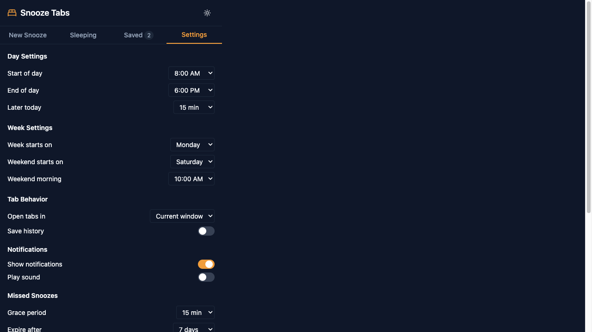

# Settings

Customize Snooze Tabs to match your schedule and preferences.

## Time Settings

### Start of Day
**Default:** 8:00 AM

When "Tomorrow" and "Next Week" snoozes wake up.

- Early bird? Set to 6:00 AM
- Night owl? Set to 10:00 AM

### End of Day
**Default:** 6:00 PM

When "This Evening" and "Tomorrow Evening" snoozes wake up.

- Leave work early? Set to 5:00 PM
- Work late? Set to 8:00 PM

### Later Today
**Default:** 15 minutes

How far in the future "Later Today" schedules.

Options: 5, 10, 15, 30, 45, 60, 90, 120 minutes

### Weekend Morning
**Default:** 10:00 AM

When "This Weekend" snoozes wake up.

## Week Settings

### Week Starts On
**Default:** Monday

Affects when "Next Week" schedules.

Options: Sunday, Monday, Saturday

### Weekend Starts On
**Default:** Saturday

Affects when "This Weekend" schedules.

Options: Friday, Saturday

## Behavior Settings

### Open Tabs In
**Default:** Current window

Where woken tabs open.

Options:
- **Current window** - Opens in your active window
- **New window** - Opens in a fresh window

### Notifications
**Default:** Enabled

Show system notifications when tabs wake up.

### Notification Sound
**Default:** Disabled

Play a sound when tabs wake up.

## History Settings

### Keep History
**Default:** Disabled

Track tabs after they wake up.

### Delete History After
**Default:** 30 days

Auto-delete old history entries.

## Missed Snooze Settings

### Grace Period
**Default:** 15 minutes

How long after scheduled time a snooze still auto-wakes.

- Within grace period → Tab opens automatically
- After grace period → Marked as "Missed"

### Expire After
**Default:** 7 days

When missed one-time snoozes are auto-deleted.

Options: Never, 1, 3, 7, 14, 30 days

### Max Pending
**Default:** 50

Maximum missed snoozes to keep before oldest are removed.

## Theme

Toggle between **Light** and **Dark** mode using the sun/moon icon in the header.

## Related

- [Quick Snooze Presets](presets.md) - How settings affect presets
- [Keyboard Shortcuts](keyboard-shortcuts.md) - Customize shortcuts in Chrome
