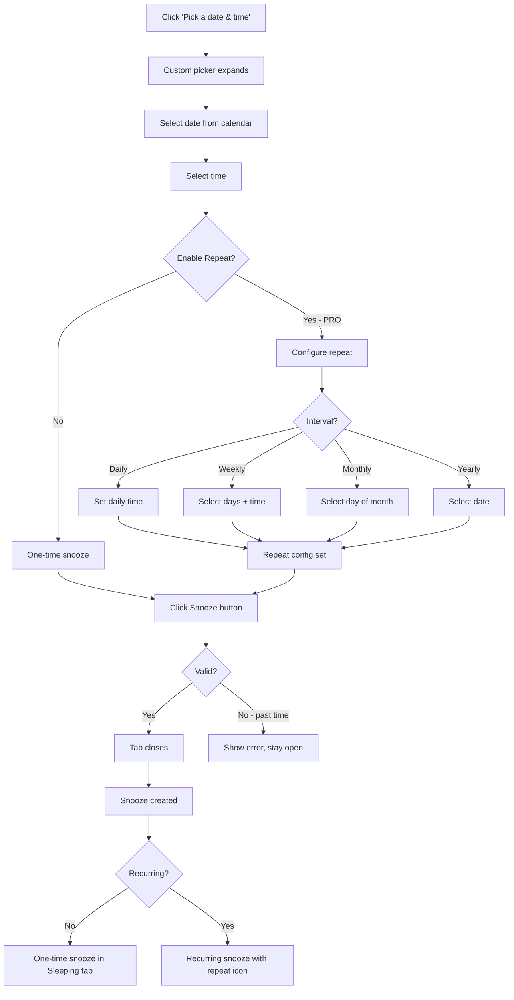

# Custom Snooze Flow

How the custom date/time picker flow works.

## Key Points

1. **Date/Time picker** - Select any future date and time
2. **Repeat option** - PRO feature for recurring snoozes
3. **Validation** - Can't schedule in the past
4. **Recurring indicator** - Shows repeat icon in Sleeping tab
