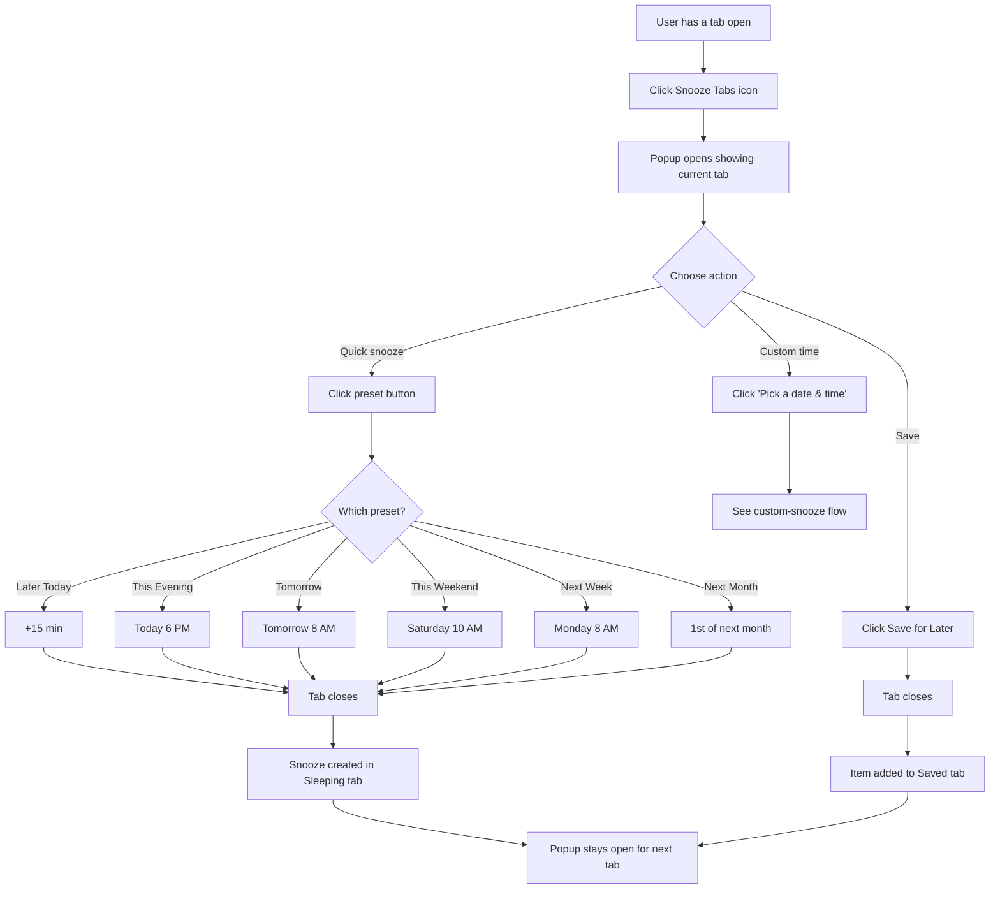

# Quick Snooze Flow

How the preset button snooze flow works.

## Key Points

1. **Preset buttons** - One click creates snooze with calculated time
2. **Tab closes** - Immediately after clicking
3. **Popup stays open** - Process multiple tabs quickly
4. **Badge updates** - Sleeping tab shows count
