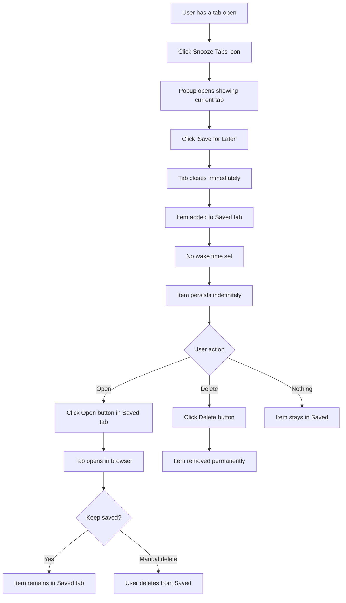
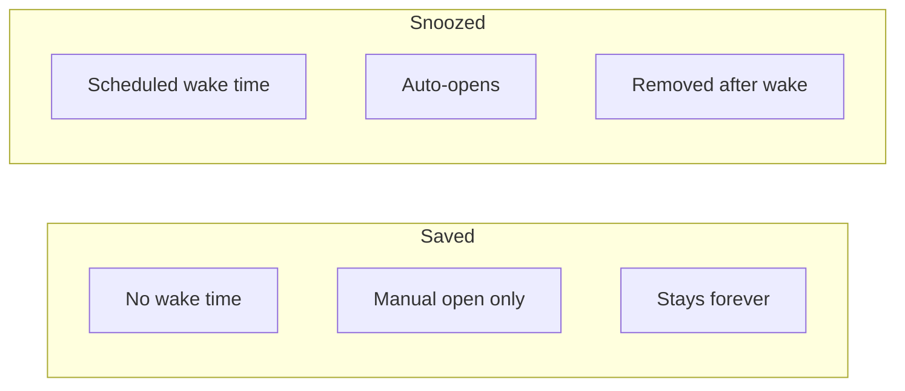

# Save for Later Flow

How the Save for Later feature works.

## Saved vs Snoozed

## Key Points

1. **No schedule** - Saved items don't have a wake time
2. **Manual only** - User decides when to open
3. **Persistent** - Items stay until manually deleted
4. **Perfect for** - Reference docs, tutorials, bookmarks
