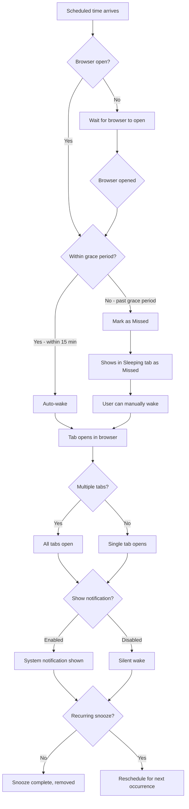

# Wake Snooze Flow

How snoozes wake up and return tabs.

## Grace Period

| Time past scheduled | Action |
|---------------------|--------|
| 0-15 minutes | Auto-wake |
| 15 min - 7 days | Marked as Missed |
| 7+ days | Expired (auto-deleted) |

## Key Points

1. **Auto-wake** - Tabs open automatically within grace period
2. **Missed snoozes** - Require manual wake
3. **Notifications** - Optional system notifications
4. **Recurring** - Auto-reschedule after wake
