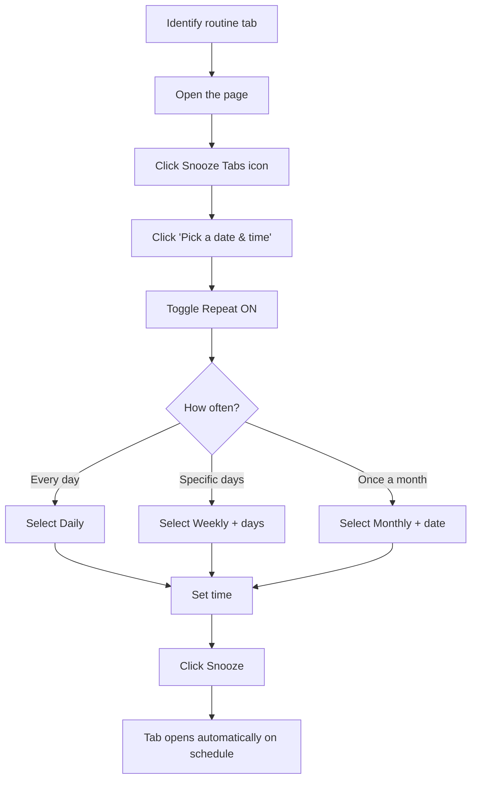

# Use Case: Daily Routines

> "I need the same pages every morning but keep forgetting to open them."

## The Problem

You have pages you check daily—standup links, dashboards, news sites—but you either forget to open them or waste time navigating to them manually.

## The Solution

Use **Recurring Snoozes** (PRO) to automatically open routine tabs at the right time.

---

## Common Daily Routines

| Routine | Schedule | Example Tabs |
|---------|----------|--------------|
| Morning standup | Daily at 9:55 AM | Zoom link, Jira board |
| News check | Daily at 8:00 AM | Hacker News, DEV.to |
| End of day review | Daily at 5:00 PM | Time tracker, tasks |
| Weekly planning | Monday at 9:00 AM | Project board, calendar |

---

## Setting Up a Daily Routine

### Example: Hacker News every morning

1. Navigate to `news.ycombinator.com`
2. Click the Snooze Tabs icon
3. Click **"Pick a date & time"**
4. Toggle **Repeat** ON
5. Select **Daily**
6. Set time to **8:00 AM**
7. Click **Snooze**

Now Hacker News opens automatically every morning at 8 AM.

---

## Weekly Routines

### Example: Standup on weekdays only

1. Navigate to your standup/meeting link
2. Click **"Pick a date & time"**
3. Toggle **Repeat** ON
4. Select **Weekly**
5. Check **Mon, Tue, Wed, Thu, Fri**
6. Set time to **9:55 AM** (5 min before meeting)
7. Click **Snooze**

---

## Flow Diagram

---

## Managing Recurring Snoozes

### Finding Them
Recurring snoozes show a **repeat icon** in the Sleeping tab.

### Waking Early
Click the wake button to open now. The schedule continues—next occurrence still happens.

### Stopping a Routine
Click the delete button to cancel the recurring snooze entirely.

### Missed Occurrences
If your browser was closed:
- The snooze shows as "Missed"
- Next scheduled occurrence still happens
- You can manually wake missed ones

---

## Pro Tips

### 1. Schedule 5 minutes early
For meetings, set the snooze 5 minutes before so you have time to prepare.

### 2. Use workspaces
Create a "Daily" workspace for all routine tabs.

### 3. Group related tabs
Snooze multiple tabs together (standup + Jira board) by using "Snooze all tabs."

### 4. Review periodically
Cancel routines you no longer need. They clutter your Sleeping tab.

---

## Example Setup: Developer Morning Routine

| Tab | Schedule | Time |
|-----|----------|------|
| Hacker News | Daily | 8:00 AM |
| GitHub notifications | Daily | 8:30 AM |
| Standup Zoom | Weekdays | 9:55 AM |
| Jira sprint board | Weekdays | 10:00 AM |
| Calendar | Daily | 8:00 AM |

---

## Related

- [Recurring Snoozes](../features/recurring.md) - Full recurring documentation (PRO)
- [Workspaces](../features/workspaces.md) - Organize routines (PRO)
- [Settings](../features/settings.md) - Customize default times
