# Use Case: Project Organization

> "My work tabs and personal tabs are all mixed together."

## The Problem

You work on multiple projects, have personal browsing, and learning materials—all in the same browser. Snoozes pile up with no way to filter or focus.

## The Solution

Use **Workspaces** (PRO) to organize snoozes by project or context.

---

## Setting Up Workspaces

### Step 1: Identify Your Contexts

Think about how you naturally group tabs:

| Context | Example Tabs |
|---------|--------------|
| 🏢 Work - Project A | Jira, GitHub, docs |
| 🏢 Work - Project B | Different repo, Figma |
| 🏠 Personal | Shopping, articles, social |
| 📚 Learning | Tutorials, courses, books |

### Step 2: Create Workspaces

1. Click the workspace selector (top right of popup)
2. Click **"New Workspace"**
3. Name it (e.g., "Project Alpha")
4. Choose an emoji (e.g., 🚀)
5. Click **Create**

Repeat for each context.

### Step 3: Assign Snoozes

When snoozing a tab:
1. Click **"Pick a date & time"**
2. Select the appropriate workspace
3. Complete the snooze

---

## Example: Developer Workspaces

```
🚀 Project Alpha     - Main product development
🔧 Project Beta      - Side project
📚 Learning          - Tutorials and courses
🏠 Personal          - Everything else
```

---

## Filtering by Workspace

### View All
Select **"All"** to see snoozes from all workspaces.

### Focus on One Project
Select a specific workspace to only see those snoozes.

**Pro tip:** When deep in Project Alpha, filter to just that workspace. Other snoozes are hidden but safe.

---

## Flow Diagram

```mermaid
flowchart TD
    A[Tab to snooze] --> B{Which project?}

    B -->|Work - Project A| C[Select 🚀 Project Alpha]
    B -->|Work - Project B| D[Select 🔧 Project Beta]
    B -->|Personal| E[Select 🏠 Personal]
    B -->|Learning| F[Select 📚 Learning]

    C --> G[Snooze with workspace]
    D --> G
    E --> G
    F --> G

    G --> H[Filter anytime by workspace]
```



---

## Workspace Strategies

### By Project
Best for developers with multiple active projects.
- 🚀 Project Alpha
- 🔧 Project Beta
- 🐛 Bug Fixes

### By Context
Best for separating work/personal life.
- 🏢 Work
- 🏠 Personal
- 📚 Learning

### By Priority
Best for GTD-style workflows.
- 🔥 Urgent
- 📋 This Week
- 📦 Backlog

---

## Pro Tips

### 1. Keep it simple
3-5 workspaces is ideal. More becomes hard to manage.

### 2. Use memorable emojis
Quick visual identification when filtering.

### 3. Review workspaces monthly
Archive or delete workspaces for completed projects.

### 4. Default workspace
Snoozes created via keyboard shortcuts go to your currently selected workspace.

---

## Combining with Other Features

### Workspaces + Recurring
Create recurring snoozes in specific workspaces:
- Daily standup → 🏢 Work
- Hacker News → 🏠 Personal

### Workspaces + Saved
Saved items also support workspaces:
- TypeScript docs → 📚 Learning
- Project API docs → 🚀 Project Alpha

### Workspaces + Sync
Workspaces sync across devices via Google Drive.

---

## Related

- [Workspaces](../features/workspaces.md) - Full workspace documentation (PRO)
- [Recurring Snoozes](../features/recurring.md) - Combine with workspaces
- [Google Drive Sync](../features/sync.md) - Sync workspaces across devices
