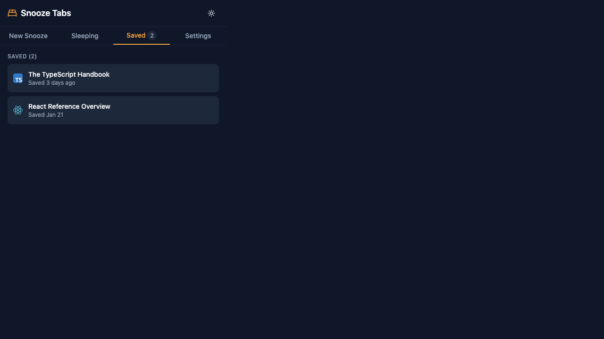
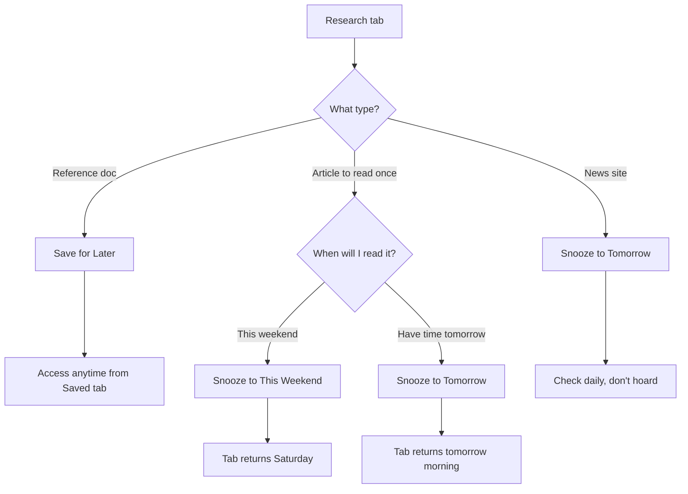

# Use Case: Research Mode

> "I keep finding interesting articles but never actually read them."

## The Problem

You're researching a topic and open 15 tabs of articles, docs, and references. You bookmark some, leave others open, and eventually lose track. The "read later" pile grows forever.

## The Solution

Use **Save for Later** for reference material and **Snooze** for content you'll actually read.

### The Key Distinction

| Content Type | Action | Why |
|--------------|--------|-----|
| Reference docs (TypeScript Handbook, API docs) | **Save for Later** | Access on-demand, no deadline |
| Articles you'll read once (tutorials, guides) | **Snooze to This Weekend** | Creates commitment to read |
| News (Hacker News, DEV.to) | **Snooze to Tomorrow** | Daily check, don't hoard |

---

## Step-by-Step: Processing Research Tabs

### Step 1: Quick Triage

Go through each tab and ask: *"Is this reference or reading material?"*

### Step 2: Save Reference Docs

For docs you'll consult multiple times:
1. Click **Save for Later**
2. Tab moves to Saved tab
3. Access anytime you need it

**Examples:**
- TypeScript Handbook
- React Reference
- API documentation

### Step 3: Snooze Reading Material

For articles you'll read once:
1. Click **This Weekend** (or appropriate preset)
2. Tab closes
3. Returns when scheduled

**Examples:**
- MDN JavaScript Guide
- Tutorial on a new library
- Blog post explaining a concept

### Step 4: Snooze News for Tomorrow

For daily news sites:
1. Click **Tomorrow**
2. Check it tomorrow morning
3. Don't let news pile up

---

## Flow Diagram

---

## Pro Tips

### 1. Don't save everything
Be honest: Will you actually read this? If not, just close it.

### 2. Use "This Weekend" generously
Weekend mornings are perfect for catching up on reading.

### 3. Review your Saved tab monthly
Delete items you haven't accessed. They're not as important as you thought.

### 4. Limit daily news
One news check per day is enough. Snooze to tomorrow, not "later today."

---

## Example Research Session

**Topic:** Learning TypeScript

| Tab | Action | Reason |
|-----|--------|--------|
| TypeScript Handbook | Save for Later | Reference, will consult often |
| "TypeScript in 5 minutes" article | Snooze to Tomorrow | Will read once tomorrow |
| Stack Overflow answer | Save for Later | Specific solution to reference |
| TypeScript GitHub repo | Save for Later | Check releases occasionally |
| Blog: "Why TypeScript" | Snooze to This Weekend | Long read for weekend |

---

## Related

- [Save for Later](../features/save-for-later.md) - Managing saved items
- [Quick Snooze Presets](../features/presets.md) - Preset options
- [Tab Overwhelm](tab-overwhelm.md) - Processing many tabs quickly
