# Use Case: Tab Overwhelm

> "I have 47 tabs open and can't focus on anything."

## The Problem

You're researching, working, or browsing and suddenly realize you have dozens of tabs open. Each one feels important, but the clutter is killing your focus. You don't want to lose them, but you can't deal with them right now.

**Common triggers:**
- Deep research rabbit holes
- "I'll read this later" tabs that pile up
- Multiple projects competing for attention
- Fear of losing important information

## The Solution

Use **Quick Snooze Presets** to clear tabs in seconds. Each tab gets scheduled to return when you're ready to deal with it.

**Key insight:** Not all tabs need the same return time. Sort them as you go:
- Daily reads (Hacker News, DEV Community) → "Tomorrow"
- One-time reads (guides, tutorials) → "This Weekend"
- Reference docs → "Save for Later"

---

## Step-by-Step Guide

### Step 1: Open the Snooze Tabs popup

Click the Snooze Tabs icon in your browser toolbar. You'll see the current tab ready to snooze.


### Step 2: Choose when you want this tab back

Look at the tab and ask: *"When will I actually need this?"*

| If you need it... | Click this preset |
| --- | --- |
| In a few minutes | **Later Today** |
| After work hours | **This Evening** |
| Tomorrow morning | **Tomorrow** |
| On the weekend | **This Weekend** |
| Next week | **Next Week** |
| Uncertain / no rush | **Save for Later** |


### Step 3: Tab closes, snooze is created

The moment you click a preset:
1. The tab closes immediately
2. A snooze is created with the scheduled wake time
3. The popup stays open for your next tab

### Step 4: Repeat for remaining tabs

Keep going! Each tab takes 2-3 seconds to process. For 20 tabs, you'll be done in under a minute.

**Pro tip:** Use keyboard shortcuts for even faster processing:
- `Alt+Shift+T` → Tomorrow
- `Alt+Shift+E` → This Evening
- `Alt+Shift+W` → This Weekend

### Step 5: Check your sleeping tabs

Switch to the **Sleeping** tab to see all your scheduled snoozes, sorted by wake time.


---

## Flow Diagram

```mermaid
flowchart TD
    A[😫 Too many tabs open] --> B[Click Snooze Tabs icon]
    B --> C[See current tab preview]
    C --> D{When do I need this?}

    D -->|Tonight| E[Click "This Evening"]
    D -->|Tomorrow| F[Click "Tomorrow"]
    D -->|Weekend| G[Click "This Weekend"]
    D -->|Reference doc| H[Click "Save for Later"]
    D -->|Specific time| I[Click "Pick a date"]

    E --> J[Tab closes instantly]
    F --> J
    G --> J
    H --> K[Tab saved to Saved tab]
    I --> L[Pick date/time] --> J

    J --> M{More tabs to process?}
    K --> M
    M -->|Yes| C
    M -->|No| N[😌 Focus restored]

    N --> O[Tabs return automatically when scheduled]
```

---

## Decision Tree: Which Preset to Use?

```mermaid
flowchart TD
    Q[Look at this tab] --> A{What type of content?}

    A -->|News / Daily read| B{Check daily?}
    B -->|Yes| C[⏰ Tomorrow<br/>e.g., Hacker News]
    B -->|Occasionally| D[📅 This Weekend<br/>e.g., DEV Community]

    A -->|Guide / Tutorial| E{Will read once?}
    E -->|Yes| F[📅 Tomorrow or Weekend<br/>e.g., MDN Guide]
    E -->|Reference material| G[🔖 Save for Later<br/>e.g., TypeScript Handbook]

    A -->|Reference docs| G

    A -->|Time-sensitive| H{When needed?}
    H -->|Today| I[🌙 This Evening]
    H -->|This week| J[📆 Next Week]

    style C fill:#fef3c7
    style D fill:#dbeafe
    style F fill:#dcfce7
    style G fill:#e5e7eb
    style I fill:#f3e8ff
```



---

## Pro Tips

### 1. Process tabs in batches
Don't overthink each decision. Quick decisions work fine—you can always wake a tab early if needed.

### 2. Use "Snooze All Tabs" for project switching
Working on Project A but need to context-switch to Project B? When you have multiple tabs open, click **"Snooze all X tabs"** to clear the entire window at once.

### 3. Set your default times
Go to Settings and customize when presets trigger:
- Night owl? Set "Tomorrow" to 10 AM instead of 8 AM
- Start work early? Set "This Evening" to 5 PM instead of 6 PM

### 4. Save reference docs, snooze everything else
**Save for Later** is perfect for documentation you'll access occasionally (TypeScript Handbook, React docs). **Snooze** is for content with a natural "when" (news, guides you'll read once).

---

## Before & After

| Before | After |
| --- | --- |
| 47 tabs open | 3 active tabs |
| Constant distraction | Focused work |
| "Where was that page?" | Tabs return when needed |
| Fear of losing info | Everything is scheduled or saved |

---

## Related Features

- [presets.md](./../features/presets.md) - Detailed preset documentation
- [save-for-later.md](./../features/save-for-later.md) - For reference docs
- [keyboard-shortcuts.md](./../features/keyboard-shortcuts.md) - Speed up your workflow
- [settings.md](./../features/settings.md) - Customize default times

---

## Quick Reference

| Keyboard Shortcut | Action |
| --- | --- |
| `Alt+Shift+S` | Later Today |
| `Alt+Shift+E` | This Evening |
| `Alt+Shift+T` | Tomorrow |
| `Alt+Shift+W` | This Weekend |
